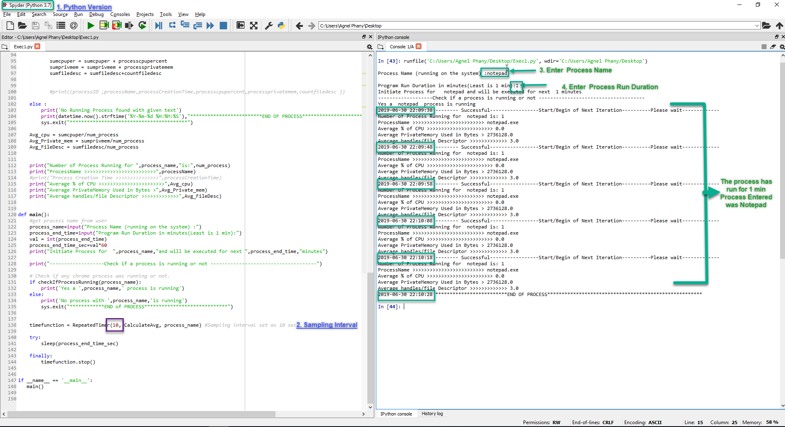

** **Project Title** ** : Python Script to get Process details 
** **Project Description** **
> Develop an application, which does the following:  
- Application is developed in Python Script
- Executable on windows machine
- Takes as an input:
  * Process Name (running on the system)
  * Program Run Duration 
  * Sampling Interval (default 10 sec)
* For the given Program Run Duration, in the specified Sampling Intervals, gather the
following data about the process: 
  *  % of CPU 
  * private memory 
  * number of handles/file descriptors 
* And it Reports
  * Report the average value for each observed parameters 
 ~~* Raise error for any suspicion of memory leak   ~~

** **Getting Started** **
* Please clone or copy the project/file into to your local machine  
* A simple copy paste from GIT also works
* If you do copy - Please save the file with extension .py 

** **Prerequisites** **
1. Please make sure your Windows machine has Python3x Installed 
2. Recommended Version is above 3 (3.7)

** **Installing** **
1. If you don't have python installed , Best would be Install Anaconda from below link ,
https://www.anaconda.com/distribution/
2. This would automatically take care of all import packages as we need below packages for this script to execute 
    import psutil
    import time
    import sys
    import threading 
3. After Installation Open Spyder(one of the application that comes with Anaconda)

** **Running the tests** **
* Have a look at below Screen short 
   
   
* Please verify and follow the steps 
 1. Version of Python
 2. Sampling interval already hardcoded to 10
* Execute the Script 
 3. Will prompt for process name - Enter the process name
 4. Will prompt for execution time - minimum is 1 min
    
 ** **Author** **
 Agnel Leon
    
